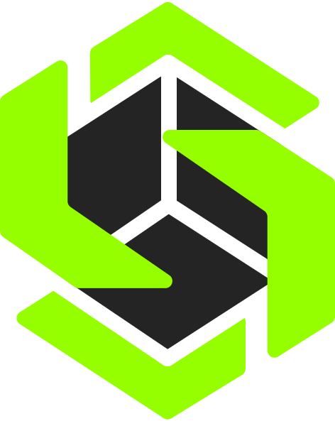

<b>🇧🇷 Português</b>

 

# Lynav Innovations

**Software que entende o problema real, entrega a solução certa e executa com a melhor performance de IA.**

---

## Sobre a empresa

A **Lynav Innovations** nasceu em **2026, no Rio de Janeiro**, das mãos de seu fundador, **Lyan Navega** — um prodígio experiente que une talento técnico a uma obsessão real por resolver problemas de negócio.

Mais do que escrever código, a Lynav existe para entender o cliente de verdade e entregar exatamente a solução que ele precisa, com a máxima eficiência possível. Toda a filosofia da empresa está condensada em três princípios que guiam cada projeto:

> **1. Entender o problema real do cliente** — antes de qualquer linha de código, entender a dor de verdade.
>
> **2. Saber dar a solução correta** — não a mais complexa, nem a mais rápida de fazer: a certa.
>
> **3. Executar com a melhor performance de IA** — aplicar o que foi planejado com excelência, acelerando a entrega sem abrir mão da qualidade.

É essa combinação — cliente no centro, solução correta e execução de alta performance — que define o trabalho da Lynav: o de uma empresa verdadeiramente comprometida com o resultado de quem confia nela.

---

## Katle — nossa plataforma principal

A **Katle** é o carro-chefe da Lynav Innovations: a **plataforma gamer oficial** da empresa, feita para quem leva os jogos a sério e quer ter controle total da própria jornada.

Na Katle, o jogador reúne num só lugar tudo o que importa da sua vida gamer:

- **Controle total dos jogos** — organize sua biblioteca e acompanhe o que está jogando, o que já zerou e o que ainda está na fila.
- **Conquistas** — registre e acompanhe suas conquistas, mantendo todo o seu progresso reunido e visível.
- **Criação de maratonas** — monte maratonas de jogos personalizadas, defina desafios e acompanhe a evolução do início ao fim.
- **Visão da sua jornada** — estatísticas e histórico que mostram, de forma clara, o quanto você já avançou.

A proposta é simples: transformar a experiência dispersa de jogar em algo organizado, acompanhável e recompensador.

---

## Outros produtos

### Stockie — ERP

Um **ERP** para gestão empresarial, que centraliza os principais processos do negócio em um único sistema. Seus módulos cobrem:

- **Estoque** — controle de produtos, entradas e saídas.
- **Financeiro** — acompanhamento de contas e movimentações.
- **Entregas** — gestão e acompanhamento das entregas.
- **Vendas** — registro e controle das vendas.

Tudo integrado para trazer organização e controle à operação do dia a dia.

### QuoteApp — Aplicativo de orçamentos

Aplicativo para **criação e gestão de orçamentos** de forma rápida e profissional. Construído em **.NET MAUI / Blazor** com banco **SQLite**, o QuoteApp permite:

- Cadastro de clientes e itens do orçamento em um fluxo simples por etapas;
- Múltiplas formas de pagamento por orçamento, com cálculo automático de parcelas e saldo restante em tempo real;
- Listagem com filtros e paginação dos orçamentos já emitidos;
- Geração de PDF profissional (via QuestPDF) pronto para enviar ao cliente;
- Código de orçamento único e imprevisível gerado com hash Base62.

---

## Tecnologias

---

## Contato

Feito no Rio de Janeiro pela Lynav Innovations.

<b>🇺🇸 English</b>

 

# Lynav Innovations

**Software that understands the real problem, delivers the right solution, and executes with the best AI performance.**

---

## About the company

**Lynav Innovations** was founded in **2026, in Rio de Janeiro**, by **Lyan Navega** — an experienced prodigy who combines technical talent with a genuine obsession for solving business problems.

More than writing code, Lynav exists to truly understand the client and deliver exactly the solution they need, with the greatest possible efficiency. The company's entire philosophy is condensed into three principles that guide every project:

> **1. Understand the client's real problem** — before any line of code, understand the actual pain.
>
> **2. Know how to deliver the correct solution** — not the most complex, nor the fastest to build: the right one.
>
> **3. Execute with the best AI performance** — apply what was planned with excellence, speeding up delivery without compromising quality.

It's this combination — client at the center, the correct solution, and high-performance execution — that defines Lynav's work: that of a company truly committed to the results of those who trust it.

---

## Katle — our flagship platform

**Katle** is Lynav Innovations' flagship: the company's **official gaming platform**, built for those who take gaming seriously and want full control of their own journey.

On Katle, players bring together in a single place everything that matters in their gaming life:

- **Full control of your games** — organize your library and keep track of what you're playing, what you've finished, and what's still in the queue.
- **Achievements** — record and track your achievements, keeping all your progress together and visible.
- **Marathon creation** — build custom game marathons, set challenges, and follow your progress from start to finish.
- **A view of your journey** — stats and history that clearly show how far you've come.

The idea is simple: turn the scattered experience of gaming into something organized, trackable, and rewarding.

---

## Other products

### Stockie — ERP

An **ERP** for business management that centralizes a company's main processes in a single system. Its modules cover:

- **Inventory** — product control, ins and outs.
- **Finance** — tracking of accounts and transactions.
- **Deliveries** — management and tracking of deliveries.
- **Sales** — recording and control of sales.

All integrated to bring organization and control to day-to-day operations.

### QuoteApp — Quotes application

An app for **creating and managing quotes** quickly and professionally. Built with **.NET MAUI / Blazor** and a **SQLite** database, QuoteApp lets you:

- Register clients and quote items in a simple step-by-step flow;
- Use multiple payment methods per quote, with automatic installment calculation and remaining balance in real time;
- List issued quotes with filters and pagination;
- Generate a professional PDF (via QuestPDF) ready to send to the client;
- Get unique, unpredictable quote codes generated with a Base62 hash.

---

## Technologies

---

## Contact

Made in Rio de Janeiro by Lynav Innovations.

